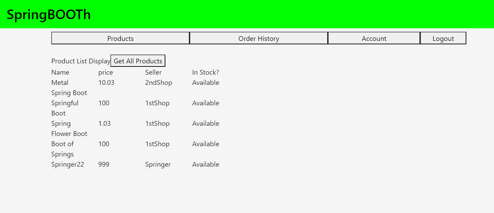

# GAproject4 Spring BOOTh
GA Project 4 Spring BOOTh, an e-commerce app.


### Description
This is a full stack web app for General Assembly's Software Engineering Immersive Unit 4 capstone project. 
In this app, there are 2 types of users accounts: Sellers and Buyers. Sellers can put items into a store page ofthe app to sell while buyers can buy items from sellers in the store.
Users can then track the their orders in the store.


### Personal Notes 
I haven't matched all end points for front end yet so back end waiting endpoints. And Back end definitely needs to refractor. 
What I think I need to do:
I just wanted to learn Java and try making a backend server within 2 weeks. It was doable but the time constraint of 2 weeks was really REALLY tiring. I only knew some C++ before learning Java on 20/04/2024. 
I couldn't have done it without the help of my course instructor and course teaching assistant.

### Screenshot(s)


### Technologies Used

#### Frontend

- React
- JavaScript
- HTML
- CSS
- Bootstrap (For column size adjustment)

#### Backend

- Java
- Spring Boot
- Spring Boot starter data Jpa
- Spring Boot starter security
- Spring Boot starter validation
- Spring Boot starter web
- Spring Boot starter test (Not used but just included)
- Spring Boot security test (Not used but just included)
- Lombok
- jjwt-api 0.11.5
- jjwt-impl 0.11.5
- jjwt-jackson 0.11.5
- PostgreSQL
- pgAdmin4 (GUI for SQL)


### Getting Started
[Wireframe proposal]()
For public board see below in ice box.

#### Front End
First clone the repository to a machine.
```
https://github.com/KevinTanCH/GAproject4.git
```
navigate to the front end code folder.
```
cd GAproject4/FRONT/BoothFE
```
Install the dependencies for front end.
```
npm i
npm i react
npm i jwt
```
Set up the .env for the frontend. Note that port number (5001) can be anything you want but must match backend port.
```
VITE_SERVER=http://127.0.0.1:5001
```
Run front end
```
npm run dev
```

#### Back End 
Download Java JDK 22 or Java.
If needed, you might have to add a System variables for JAVA_HOME point to where you install your jdk_22 or java.
The Maven 3.8.8 will read the pom.xml and should take care of the depencies of backend.
Set up the back end application properties file. The values can be anything but be sure to match the values to front end and database.
```
spring.application.name=Booth
spring.datasource.url= jdbc:postgresql://localhost:5432/dbspringbooth
server.port=5001
spring.datasource.driver-class-name=org.postgresql.Driver
spring.datasource.username= db_user
spring.datasource.password= usethesamepasswordasdb
spring.jpa.hibernate.ddl-auto=update
security.jwt.expiration-time = 1800000
security.jwt.expiration-time-refresh = 2592000000
#From base64encode.org
security.jwt.secret-key = getarandomkeyfromanywherebutigotmindfrombase64encode
```
However for code editing, if you are using IntelliJ IDEA Community Edition 2024.1, intall Lombok plugins for easier code editing.
To run, open the application.java file and click the run button on IntelliJ or use the mvn run command:
```
./mvnw spring-boots:run
```

#### Database (PostgreSQL)
Download and run PostgreSQL.
Run PostgreSQL SQL shell. Not that database name and owner(user) can be anything but must match the back end application properties file.
```
create database dbspringbooth;
\c dbspringbooth
grant all on  schema public to db_user;
```


### How to use

#### Login/Registration:

#### Buyer:

#### Seller:


### Resources
- [w3schools on JAVA](https://www.w3schools.com/java/)
- [tutorials point on Spring Boot](https://www.tutorialspoint.com/spring_boot )
- [w3schools on Spring Boot](https://www.w3schools.blog/spring-boot-tutorial )
- [geeksforgeeks](https://www.geeksforgeeks.org/spring-boot/?ref=lbp)
- [baeldung for Spring Boot](https://www.baeldung.com/)
- [Hibernate Doc for how to use hibernate in Java for database annotation](https://docs.jboss.org/hibernate/orm/6.4/introduction/html_single/Hibernate_Introduction.html)
- [JWT tutorial code from Di Stephano](https://github.com/stefanoHTB/spring-security-jwt)


### Planned future enhancements (icebox items)
Link to personal Kanban and public board (User Stories):
- [kanban](https://github.com/users/KevinTanCH/projects/3)
- [Public board](https://github.com/users/KevinTanCH/projects/1/views/1)
